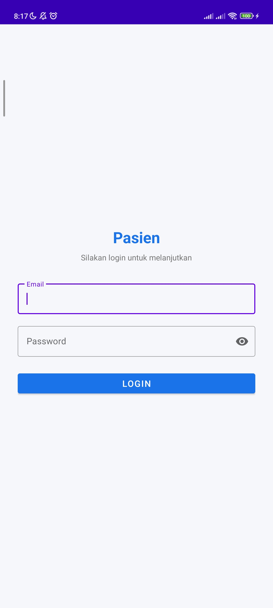
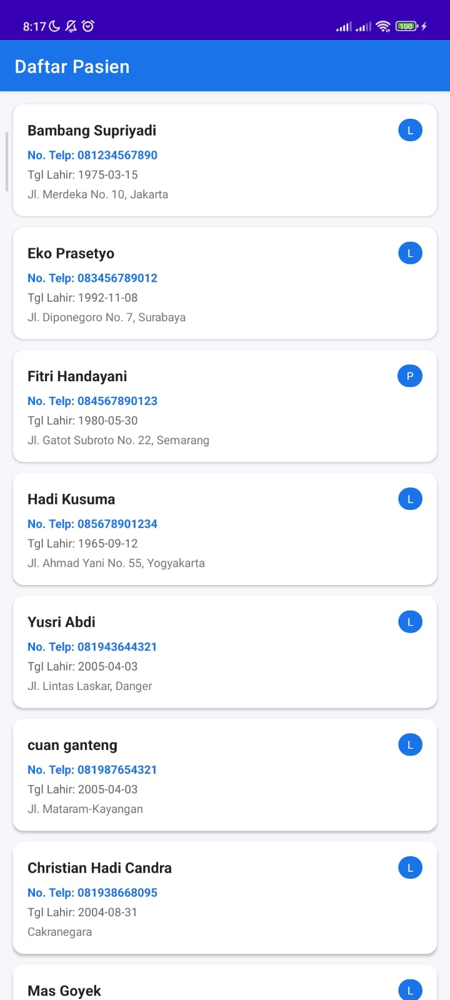

# Aplikasi Data Pasien

Aplikasi Android sederhana untuk menampilkan daftar data pasien menggunakan REST API. Dibangun dengan Kotlin, Retrofit, dan RecyclerView.

---

## Screenshot

| Login                           | Daftar Pasien                            |
|---------------------------------|------------------------------------------|
|  |  |


---

## ✨ Fitur

- Login menggunakan email dan password via API
- Menyimpan token autentikasi di SharedPreferences
- Menampilkan daftar pasien menggunakan RecyclerView
- Swipe to refresh untuk memperbarui data
- Logout dengan konfirmasi dialog
- Handling empty state dan error koneksi

---

## Teknologi

| Library | Versi | Fungsi |
|---------|-------|--------|
| Kotlin | 1.9.20 | Bahasa pemrograman utama |
| Retrofit | 2.9.0 | HTTP Client |
| Gson | 2.9.0 | JSON Parser |
| OkHttp Logging | 4.12.0 | Debug network request |
| Coroutines | 1.7.3 | Async / background task |
| ViewBinding | - | Binding layout XML ke Kotlin |
| Material Components | 1.11.0 | UI Components |

---

## API

Base URL: `https://api.pahrul.my.id/api/`

| Method | Endpoint | Keterangan |
|--------|----------|------------|
| POST | `/login` | Login, mendapatkan token |
| GET | `/pasien` | Mengambil daftar pasien (butuh token) |

### Login

```json
email   : admin@example.com
password: password
```
---

## Struktur Project

```
app/
└── src/main/
    ├── java/com/core/pasien/
    │   ├── api/
    │   │   ├── ApiService.kt          # Interface endpoint Retrofit
    │   │   └── RetrofitClient.kt      # Singleton Retrofit instance
    │   ├── adapter/
    │   │   └── PasienAdapter.kt       # RecyclerView adapter
    │   ├── model/
    │   │   ├── LoginRequest.kt        # Body request login
    │   │   ├── LoginResponse.kt       # Response login + token
    │   │   ├── Pasien.kt              # Model data pasien
    │   │   └── PasienResponse.kt      # Wrapper response list pasien
    │   ├── LoginActivity.kt           # Halaman login
    │   └── PasienActivity.kt          # Halaman daftar pasien
    └── res/
        ├── layout/
        │   ├── activity_login.xml
        │   ├── activity_pasien.xml
        │   └── item_pasien.xml
        └── values/
            ├── colors.xml
            ├── strings.xml
            └── themes.xml
```

---

## Cara Menjalankan

1. Clone repository ini
   ```bash
   git clone https://github.com/spicarf/T5-mobile
   ```

2. Buka di **Android Studio**

3. Pastikan koneksi internet aktif (API bersifat online)

4. Jalankan di emulator atau perangkat fisik (**min SDK 24 / Android 7.0**)

5. Login menggunakan akun yang terdaftar di sistem

---

## ⚙Konfigurasi

Jika ingin mengganti base URL API, ubah di `RetrofitClient.kt`:

```kotlin
private const val BASE_URL = "https://api.pahrul.my.id/api/"
```

---

## Developer

| |                     |
|-|---------------------|
| **Nama** | *Raffi Fatthoni*    |
| **NIM** | *F1D02310133*       |
| **Mata Kuliah** | Pemrograman Mobile  |
| **Universitas** | Universitas Mataram |
